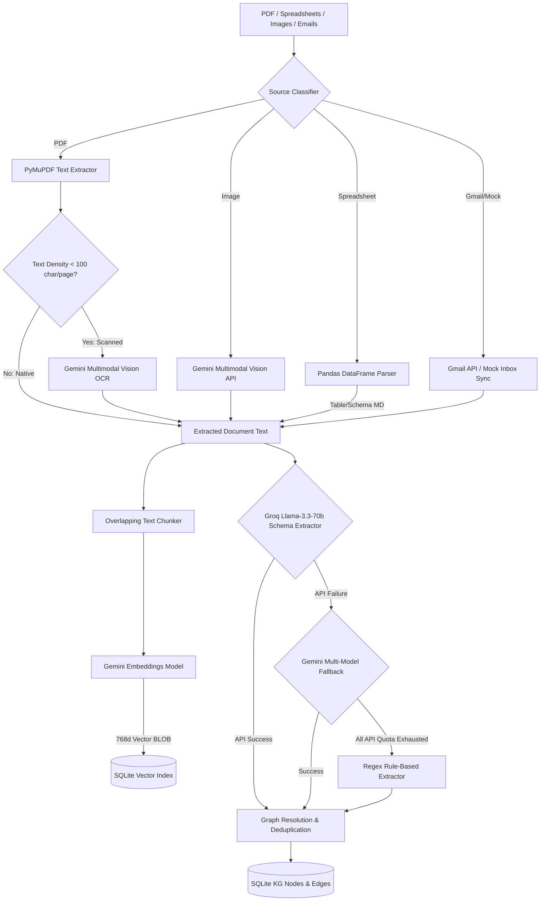

# Module 1: Universal Ingestion & Knowledge Graph Subsystem

This subsystem provides the foundation for the Knowledge Graph Cockpit. It operates as a high-throughput, format-agnostic data ingestion pipeline combined with a semantic knowledge extraction engine. 

It handles raw files (PDFs, spreadsheets, images) and email threads, parses their contents, indexes them in a local vector space, extracts entity-relationship structures via a multi-model LLM strategy, and merges them into a unified SQLite-based Knowledge Graph.

---

## 🏗️ Architecture & Component Design

The ingestion and retrieval process flows through the following pipeline stages:



### 1. Component Overview

1. **Environment Configuration ([config.py](file:///d:/OneDrive/Music/Desktop/ET-Hackathon-Models/Module%201/backend/config.py))**:
   - Manages directory creation (`uploads/`, `outputs/queries/`, `outputs/mindmaps/`, `outputs/flowcharts/`).
   - Standardizes environment variables including API keys and OAuth secrets paths.

2. **Universal Parsers ([parser_service.py](file:///d:/OneDrive/Music/Desktop/ET-Hackathon-Models/Module%201/backend/parser_service.py))**:
   - **PDF Parsing**: PyMuPDF (`fitz`) retrieves page text. If the text density is `< 100` characters per page, it tags the page for OCR fallback.
   - **Spreadsheet Parsing**: `pandas` reads Excel/CSV. Large sheets are formatted dynamically (column descriptions + a 10-row preview table) to conserve token context, while small sheets are fully translated into Markdown tables.
   - **Multimodal Page Rendering**: Renders individual PDF pages to PNG binaries to support downstream Gemini visual OCR.

3. **Multi-Model Fallback Service ([gemini_service.py](file:///d:/OneDrive/Music/Desktop/ET-Hackathon-Models/Module%201/backend/gemini_service.py))**:
   - **Structured LLM Calls**: Invokes Groq API `llama-3.3-70b-versatile` in JSON mode using specific Pydantic schemas ([DocumentSchema](file:///d:/OneDrive/Music/Desktop/ET-Hackathon-Models/Module%201/backend/gemini_service.py#L38), [GroundedAnswerSchema](file:///d:/OneDrive/Music/Desktop/ET-Hackathon-Models/Module%201/backend/gemini_service.py#L47)).
   - **Sequential Fallback Execution**: If Groq API limits are exceeded, calls Gemini models (`gemini-2.0-flash`, `gemini-flash-latest`, `gemini-2.5-flash`, `gemini-3.5-flash`) sequentially.
   - **Regex Rule-Based Ingestion**: If all API endpoints are blocked or exhausted, executes deterministic regex routines to extract equipment tags and dates to prevent pipeline failures.

4. **Vector Database Service ([vector_service.py](file:///d:/OneDrive/Music/Desktop/ET-Hackathon-Models/Module%201/backend/vector_service.py))**:
   - **Chunking**: Generates overlapping text segments (800 characters size, 150 characters overlap).
   - **Embeddings**: Calls `models/gemini-embedding-001` or `models/gemini-embedding-2` to obtain 768-dimensional float arrays.
   - **Local Vector Search**: Calculates Cosine Similarity on float vectors directly in RAM using NumPy dot products, avoiding external Vector DB overhead.

5. **Relational Graph Database ([database.py](file:///d:/OneDrive/Music/Desktop/ET-Hackathon-Models/Module%201/backend/database.py))**:
   - Uses SQLite to model document lists, nodes (deduplicated by normalization), edges, join tables for document citation tracking, vectors, Q&A history, and cached visualizations.

6. **Gmail Inbox Sync ([gmail_service.py](file:///d:/OneDrive/Music/Desktop/ET-Hackathon-Models/Module%201/backend/gmail_service.py))**:
   - Manages OAuth 2.0 readonly connections to Gmail to retrieve email headers and body segments.
   - Contains simulated mock emails containing operational incidents (e.g. emergency pump inspections) to facilitate testing.

7. **FastAPI Web Service ([main.py](file:///d:/OneDrive/Music/Desktop/ET-Hackathon-Models/Module%201/backend/main.py))**:
   - Exposes web API routes on port `8000` for file uploads, query execution, Gmail syncing, and visualization data generation.

8. **CLI Administration Console ([cli.py](file:///d:/OneDrive/Music/Desktop/ET-Hackathon-Models/Module%201/backend/cli.py))**:
   - Terminal control console presenting statistics, manual file ingestion tools, Q&A testing, and flowchart/mindmap generators.

9. **Verification Testing & Reset Utilities**:
   - [verify_backend.py](file:///d:/OneDrive/Music/Desktop/ET-Hackathon-Models/Module%201/backend/verify_backend.py): Fully automated integration script verifying DB setup, API keys, embeddings, structured extractions, subgraphs, RAG, and diagram creation.
   - [reset_data.py](file:///d:/OneDrive/Music/Desktop/ET-Hackathon-Models/Module%201/backend/reset_data.py): Hard-resets the database schema, empties uploads, and purges all output caches.

---

## 📂 Folder Structure

```
Module 1/
└── backend/
    ├── uploads/                # Stores raw uploaded files (PDFs, Images, Spreadsheets)
    ├── outputs/                # System outputs and artifacts
    │   ├── queries/            # Grounded Q&A session markdown files (.md)
    │   ├── mindmaps/           # Hierarchical Mindmap outlines (.json and .md)
    │   └── flowcharts/         # Sequential workflow flowchart code (.mmd)
    ├── config.py               # Path definitions & API configurations
    ├── database.py             # SQLite schema design & node-edge operations
    ├── parser_service.py       # Extractors for PDFs, CSV/XLSX, and images
    ├── vector_service.py       # Chunking algorithms & local NumPy Cosine Similarity
    ├── gemini_service.py       # Multi-model LLM extractors and fallbacks
    ├── gmail_service.py        # Gmail OAuth 2.0 & mock email synchronization
    ├── main.py                 # FastAPI API Server routing & background tasks
    ├── cli.py                  # Operational console terminal dashboard
    ├── verify_backend.py       # Integration verification test runner
    └── reset_data.py           # Admin utility to wipe database and caches
```

---

## ⚡ Getting Started

### 1. Prerequisites
Ensure you have Python 3.9+ installed and run:
```bash
pip install fastapi uvicorn sentence-transformers pypdf python-dotenv google-generativeai pandas tabulate openpyxl pillow numpy httpx google-auth-oauthlib google-api-python-client pymupdf
```

### 2. Environment Variables
Configure a `.env` file inside the `Module 1/backend/` folder:
```env
GEMINI_API_KEY=your_google_gemini_api_key_here
GROQ_API_KEY=gsk_your_groq_api_key_here
```

### 3. Verification Test
Verify all APIs and database linkages by executing the test harness:
```bash
cd "Module 1/backend"
python verify_backend.py
```
This will test the database setup, embedding calls, document indexing, entities/relationships extraction fallback, subgraph fetch, RAG Q&A, and mindmap/flowchart generation.

### 4. Running the Applications
- **FastAPI API Server**:
  ```bash
  uvicorn main:app --host 0.0.0.0 --port 8000 --reload
  ```
- **CLI Administration Dashboard**:
  ```bash
  python cli.py
  ```

---

## 📡 API Reference

### 1. Upload Document
- **Endpoint**: `POST /documents/upload`
- **Body**: multipart/form-data (Key: `file`, Value: File object)
- **Response**:
  ```json
  {
    "id": "doc_9e4c1a2f3b",
    "source_type": "pdf",
    "filename": "P-204_SOP.pdf",
    "uploaded_by": "user",
    "uploaded_at": "2026-07-17T16:03:52.421Z",
    "status": "Queued"
  }
  ```

### 2. Grounded RAG Query
- **Endpoint**: `POST /query`
- **Payload**:
  ```json
  {
    "question": "What is the pressure threshold for P-204?"
  }
  ```
- **Response**:
  ```json
  {
    "id": "q_7b8a1c2d",
    "answer": "The maximum allowable pressure for Pump P-204 is 120 PSI [doc_9e4c1a2f3b]...",
    "sources": [
      { "filename": "P-204_SOP.pdf", "ref": "Page 2" }
    ],
    "confidence": 0.95
  }
  ```

### 3. Generate Mindmap Structure
- **Endpoint**: `POST /visualize/mindmap`
- **Payload**:
  ```json
  {
    "document_id": "doc_9e4c1a2f3b"
  }
  ```
- **Response**: Hierarchical mindmap JSON tree containing parent-child node pointers.

### 4. Generate Flowchart Mermaid Code
- **Endpoint**: `POST /visualize/flowchart`
- **Payload**:
  ```json
  {
    "document_id": "doc_9e4c1a2f3b"
  }
  ```
- **Response**:
  ```json
  {
    "mermaid_code": "graph TD\n  Start[Start SOP] --> Step1[Isolate V-102]..."
  }
  ```

### 5. Fetch Entire Knowledge Graph
- **Endpoint**: `GET /graph`
- **Response**: Complete lists of nodes and edges currently stored in the SQLite DB.
