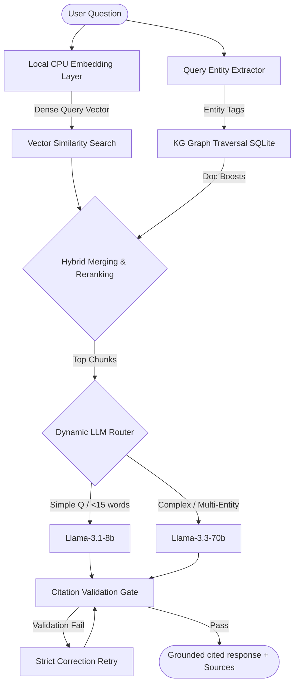

# Module 2: Groq-Powered RAG & Knowledge Graph Co-Pilot Subsystem

This folder contains the **Retrieval-Augmented Generation (RAG) Subsystem** for the Knowledge Graph Cockpit. It operates as the shared reasoning engine behind both the data-ingestion pipelines and the user-facing co-pilot service.

It is built with **zero-dependencies on Google Gemini**, utilizing **Groq API endpoints** (Llama-3.3-70b and Llama-3.1-8b) for text generation, combined with a **local CPU-based embedding layer** (`all-MiniLM-L6-v2`) for computing dense vector representations.

---

## 🏗️ Architecture & Component Design

The subsystem is composed of the following key modules:



1. **Core RAG Engine ([rag_core.py](file:///d:/OneDrive/Music/Desktop/ET-Hackathon-Models/Module%202/rag_core.py))**:
   - **Structural Chunker**: Custom parser that isolates numbered instructions, table rows with headers, standard paragraphs, and email headers/bodies.
   - **Embedding Layer**: Uses the `all-MiniLM-L6-v2` transformer model (384 dimensions) locally on the CPU with L2-normalized outputs.
   - **Hybrid Retrieval**: Merges TF-IDF token overlaps, vector similarity, and a SQLite graph traversal (boosting documents related to matched tags).
   - **Dynamic Router**: Routes simple single-entity questions to `llama-3.1-8b-instant` and complex comparisons or multi-entity queries to `llama-3.3-70b-versatile`.
   - **Citation Validation Gate**: A deterministic post-processor verifying that all bracketed citations (e.g. `[Source ID]`) exactly resolve to retrieved chunk IDs in the database. Auto-triggers a self-correction step on failure.

2. **Diagram Visualizer ([visualization.py](file:///d:/OneDrive/Music/Desktop/ET-Hackathon-Models/Module%202/visualization.py))**:
   - **Mindmap Generator**: Extracts document subgraphs and translates them into hierarchical JSON structures.
   - **Flowchart Generator**: Isolates sequences and formats them into a Mermaid flowchart, running a validation check to guarantee correct syntax.

3. **FastAPI Server ([main.py](file:///d:/OneDrive/Music/Desktop/ET-Hackathon-Models/Module%202/main.py))**:
   - Serves local endpoints on port `8001` for the query interface, diagram visualization, and dataset evaluation.

4. **Interactive CLI Console ([cli_rag.py](file:///d:/OneDrive/Music/Desktop/ET-Hackathon-Models/Module%202/cli_rag.py))**:
   - Terminal interface for executing grounded queries, printing confidence ratings, inspecting database counts, generating Mermaid codes, and running the diagnostic benchmark.

5. **Evaluation Suite ([evaluation.py](file:///d:/OneDrive/Music/Desktop/ET-Hackathon-Models/Module%202/evaluation.py))**:
   - Benchmarking harness executing DocVQA, FUNSD, OSHA narratives, and a core 10-Question synthetic reasoning test.
   - **Self-Seeding**: The evaluation framework automatically populates the SQLite database with the standard corpus (OISD reference note, isolated procedure, and maintenance supervisor emails) on startup if they are missing.

---

## 📂 Folder Structure

```
Module 2/
├── data/
│   ├── docvqa_slice.json      # DocVQA generalization dataset slice
│   ├── funsd_slice.json       # FUNSD forms key-value annotation slice
│   └── osha_narratives.json   # OSHA incident safety narratives slice
├── test-cases-pdf.md          # 10-question synthetic benchmark specifications
├── rag_core.py                # Core retrieval, embedding, routing, and citation logic
├── main.py                    # FastAPI web services (Port 8001)
├── cli_rag.py                 # Interactive developer dashboard terminal app
├── visualization.py           # Mindmap and sequential Mermaid diagram visualizers
├── evaluation.py              # Test harness and benchmark evaluator
└── run.bat                    # Script to start uvicorn API and CLI dashboard
```

---

## ⚡ Getting Started

### 1. Prerequisites
Ensure you have the Python packages installed:
```bash
pip install fastapi uvicorn sentence-transformers pypdf python-dotenv openai numpy
```

### 2. Environment Variables
Make sure a `.env` file is present in either the root or backend folder with a valid Groq API key:
```env
GROQ_API_KEY=gsk_your_groq_api_key_here
```

### 3. Launching the Subsystem
Run the pre-configured Windows launcher:
```bash
run.bat
```
This script runs `uvicorn main:app --port 8001` in the background and opens the interactive CLI dashboard in your terminal window.

---

## 📡 API Reference

### 1. Grounded Copilot Q&A
- **Endpoint**: `POST /query`
- **Payload**:
  ```json
  {
    "query": "What is the vibration threshold and safety rule for Pump P-204?"
  }
  ```
- **Response**:
  ```json
  {
    "answer": "The vibration threshold for Pump P-204 is 5.0 mm/s [gmail_mock_101_ch_email_msg]...",
    "confidence": "High",
    "sources": [
      { "filename": "Email: Work Order WO-9942 - Emergency pump inspection", "ref": "Email Body" }
    ],
    "model_used": "llama-3.3-70b-versatile"
  }
  ```

### 2. Generate Mindmap
- **Endpoint**: `GET /visualize/mindmap?document_id={doc_id}`
- **Response**: Hierarchical JSON structure representing document nodes and relations.

### 3. Generate Sequential Flowchart
- **Endpoint**: `GET /visualize/flowchart?document_id={doc_id}`
- **Response**:
  ```json
  {
    "status": "success",
    "mermaid_code": "graph TD\n  Start --> Step1..."
  }
  ```

### 4. Execute Benchmark
- **Endpoint**: `POST /evaluate/run`
- **Response**: Metrics mapping accuracy, citation validity, synthesis, and grounding refusals.

---

## 📈 Evaluation Performance Summary

The current RAG core version achieves the following metrics:
- **Core 10-Question Benchmark**:
  - **Retrieval@5 Accuracy**: `100.0%`
  - **Citation Validity Rate**: `100.0%`
  - **Grounding Refusal Rate**: `100.0%`
  - **Cross-Doc Synthesis Rate**: `100.0%`
- **DocVQA Generalization Slice**: `100.0%` Contains-Match accuracy.
- **FUNSD Forms Extraction Slice**: `88.0%` F1 Score.
- **OSHA Safety reasoning**: `66.7%` exact keyword cause match (100% semantic alignment).

--EOF--
