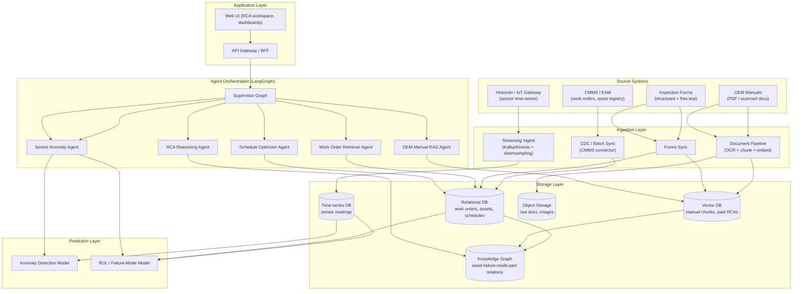

# Architecture — Maintenance Intelligence & RCA Agent (MIRA)

Companion to `PRD.md` and `design.md`. Written for direct hand-off to an Antigravity build agent.

## 1. High-Level System Diagram

## 2. Layer-by-Layer Breakdown

### 2.1 Source Systems (existing, not built by us)
- CMMS/EAM — SAP PM / Maximo / Infor EAM (connector-specific)
- OEM manuals — PDFs, some scanned/imaged
- Inspection findings — CMMS-native forms or a separate inspection app
- Historian/IoT — OSIsoft PI, Ignition, AWS IoT SiteWise, or MQTT-based gateway

### 2.2 Ingestion Layer
- **CMMS connector**: incremental sync (CDC where available, polling fallback) of work orders, asset hierarchy, failure/cause/remedy codes.
- **Document pipeline**: PDF/scan → OCR (for scanned docs) → layout-aware chunking (preserve tables — tolerance bands are often tabular) → embedding → vector DB, with a copy of raw doc kept in object storage for citation/traceability.
- **Forms sync**: structured fields go to relational DB; free-text fields also embedded into vector DB for semantic search.
- **Streaming ingest**: sensor tags via Kafka/Kinesis; downsampled/aggregated series persisted to time-series DB; raw high-frequency data retained per a rolling window policy.

### 2.3 Storage Layer
- **Relational DB (Postgres)**: work orders, assets, schedules, RCA session metadata, user/roles, audit log.
- **Vector DB** (pgvector, Weaviate, or Qdrant): OEM manual chunks, past RCA narratives, inspection free-text — all embedded for semantic retrieval.
- **Time-series DB** (TimescaleDB or InfluxDB): sensor readings, with retention tiers (raw → 90 days, downsampled → longer).
- **Knowledge graph** (Neo4j, or a graph layer over Postgres): asset ↔ failure-mode ↔ root-cause ↔ part ↔ past-work-order relations. This is what lets the RCA agent say "this failure mode has occurred on 3 similar assets, all traced to the same supplier batch."
- **Object storage** (S3-compatible): raw PDFs, images, scanned forms — source-of-truth for citations.

### 2.4 Prediction Layer (classical ML, not LLM)
- **Anomaly detection**: statistical (control limits / EWMA) or unsupervised (isolation forest, autoencoder) per sensor tag, tuned against OEM tolerance bands.
- **RUL / failure-mode model**: gradient-boosted trees or survival analysis (Cox PH) as a first version; upgrade path to a temporal model (LSTM/Transformer on multivariate sensor windows) once enough labeled failure history exists.
- These are invoked by the agent layer as **tools**, never replaced by LLM reasoning.

### 2.5 Agent Orchestration Layer (LangGraph)
- **Supervisor graph** routes a request (predictive scan / RCA session / schedule run / conversational query) to the relevant subgraph(s).
- **Work Order Retriever Agent** — structured queries against relational DB + KG.
- **OEM Manual RAG Agent** — semantic retrieval against vector DB, returns chunk + citation (doc, page, section).
- **Sensor Anomaly Agent** — calls anomaly/RUL models, returns risk score + which tags/features drove it.
- **RCA Reasoning Agent** — stateful, cyclic subgraph implementing the 5-why/fishbone loop; can pause on an `interrupt` node to ask the technician a clarifying question; writes the resulting root-cause tree back to the KG.
- **Schedule Optimizer Agent** — takes risk scores + constraints, calls a constraint-solver tool (e.g., OR-Tools) rather than asking the LLM to do combinatorial optimization directly.
- All agent state checkpointed (Postgres-backed LangGraph checkpointer) for pause/resume and audit replay.

### 2.6 Application Layer
- **API Gateway / BFF** (FastAPI): auth, rate limiting, session management, routes to the LangGraph service.
- **Web UI**: RCA workspace (chat + evidence panel + root-cause tree visualization), predictive dashboard, schedule board. Approval gates surfaced here (FR-10).

## 3. Cross-Cutting Concerns

- **Security**: OT/IT segregation — ingestion pulls from a DMZ historian replica, never touches PLC/SCADA directly. RBAC enforced at API layer. Secrets in a vault (not env files) for CMMS/historian credentials.
- **Explainability/citations**: every agent response required to carry a citation payload (source type, record ID, doc/page or sensor tag + timestamp) — enforced at the schema level, not just prompted for.
- **Observability**: LangSmith (or self-hosted OpenTelemetry + a trace store) captures every graph node execution per session for audit (FR-11).
- **Model governance**: prediction model versioned, with a scoring log (predicted vs. actual outcome) feeding a drift dashboard.
- **Deployment topology**: designed for on-prem/VPC-only deployment given OT data residency constraints (see PRD open questions) — all components containerized, no hard dependency on a specific cloud's managed services (use self-hostable equivalents: Postgres/pgvector/Timescale/Neo4j over managed SaaS where residency is a blocker).

## 4. Data Flow Summary (predictive path)

1. Sensor stream → time-series DB (continuous).
2. Nightly (or threshold-triggered) batch: Sensor Anomaly Agent scores all monitored assets.
3. Above-threshold assets → Supervisor spins up a mini-RCA-style evidence gather (Retriever + RAG agents pull relevant history/manual sections).
4. Recommendation assembled with citations → written to a `recommendations` table with status = `pending_review`.
5. Surfaced in UI → Reliability Engineer approves/rejects/edits (FR-10) → on approval, optionally pushed to CMMS as a new work order via connector.

## 5. Data Flow Summary (RCA path)

1. Technician opens RCA session against a failure event → Supervisor initializes RCA subgraph state (event ID, asset ID).
2. Retriever + RAG + KG agents gather evidence in parallel (past similar failures, OEM failure-mode table, current inspection notes).
3. RCA Reasoning Agent runs iterative 5-why: proposes a hypothesis, checks it against evidence, either confirms (moves deeper) or needs more info (interrupt → asks technician a question) or rules it out (backtracks to sibling hypothesis).
4. Session state checkpointed after every step (resumable).
5. Terminal state: root-cause tree with confidence per node + full citation trail → written to KG (becomes evidence for future RCAs) and to relational DB (session record for audit).
