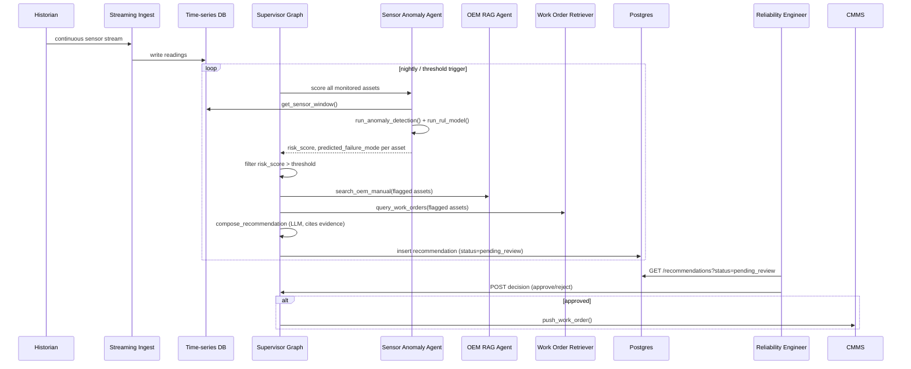
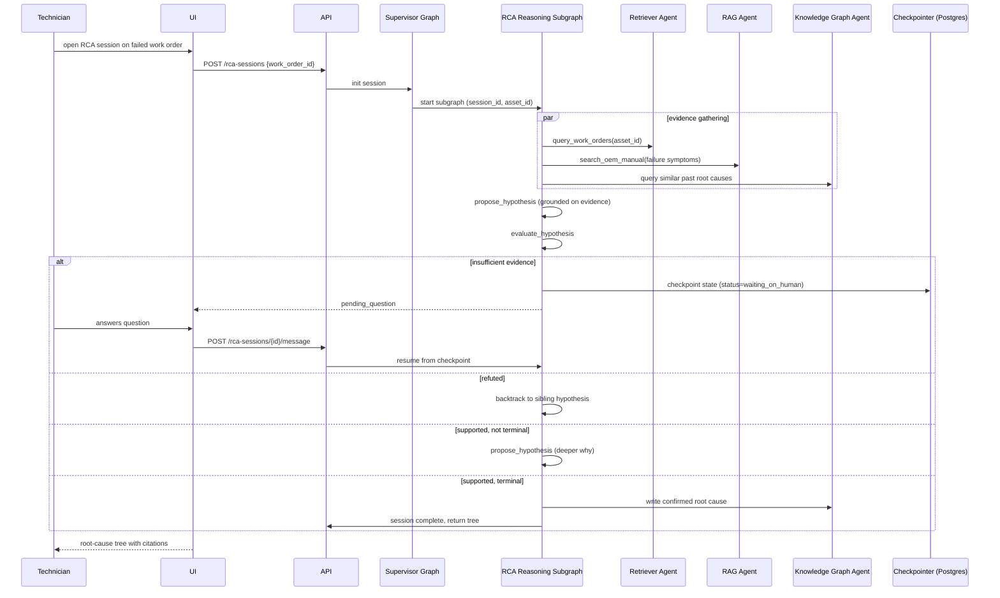
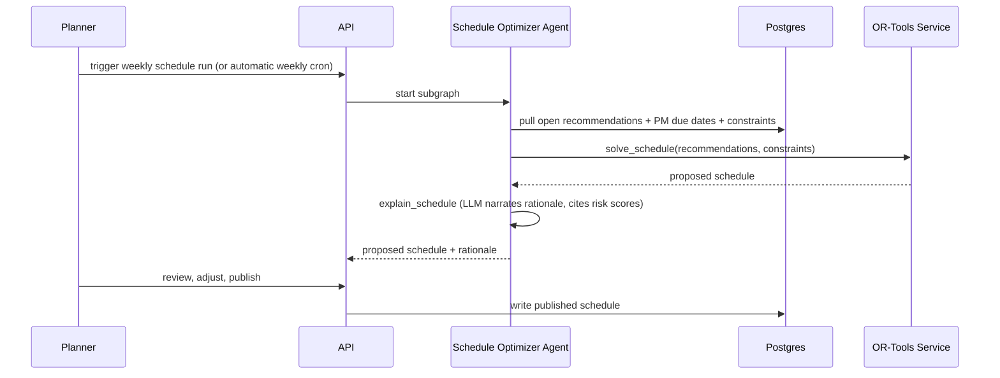
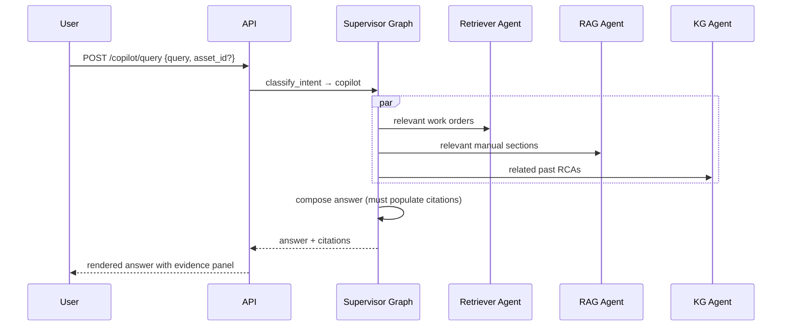

# Workflow — Maintenance Intelligence & RCA Agent (MIRA)

Companion to `PRD.md`, `architecture.md`, `design.md`. Describes end-to-end operational workflows.

## Workflow 1 — Predictive Recommendation (system-initiated)

**Trigger:** nightly batch scan, or a sensor anomaly crossing a hard threshold mid-day (real-time exception path).
**Human touchpoint:** Reliability Engineer reviews and approves/rejects before anything reaches the CMMS.
**Failure mode handling:** if `run_anomaly_detection`/`run_rul_model` returns low confidence, the recommendation is still surfaced but flagged `low_confidence` rather than suppressed — avoids silently hiding a marginal signal.

## Workflow 2 — RCA Session (technician-initiated)

**Trigger:** technician or engineer opens an RCA session against a failure event.
**Resumability:** because state is checkpointed after every node, a technician can close the browser mid-session and resume hours later without losing reasoning progress.
**Output feedback loop:** confirmed root causes are written back to the knowledge graph, so the *next* RCA on a similar asset starts with richer evidence — this is the compounding-value mechanism of the whole system.

## Workflow 3 — Schedule Optimization (planner-initiated, periodic)

**Conflict flagging:** if the solver cannot satisfy all constraints (e.g., two high-risk assets need the same specialist crew the same week), it returns the best feasible schedule plus a list of unresolved conflicts, which the LLM narration surfaces explicitly rather than silently dropping one asset.

## Workflow 4 — Copilot Query (conversational, any time)

**Design intent:** this is the lowest-risk, fastest-to-trust surface (Phase 1 in the PRD rollout plan) — it's read-only, always cited, and builds user confidence in the system before RCA/predictive/scheduling automation is introduced.

## Cross-Workflow Invariants

- No workflow writes to the CMMS without an explicit human approval step (Workflow 1) or an explicit publish action (Workflow 3).
- Every LLM-generated user-facing claim carries `evidence_refs`; the UI has no code path that renders a claim without a citation panel.
- Every agent session (RCA, predictive scan, schedule run) is checkpointed and logged to `audit_log` for compliance replay.
