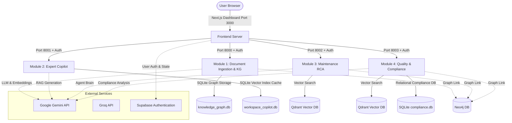

# 🧠 ET Unified Operations Brain

Welcome to the **ET Unified Operations Brain**, an integrated AI-driven operations control system. The platform consists of four modular machine learning and retrieval-augmented intelligence agents (FastAPI-based backends) coordinated with a premium, dynamic web dashboard (Next.js frontend).

This project integrates state-of-the-art Large Language Models (LLMs) via Google Gemini and Groq, Knowledge Graphs (Neo4j), and vector search (Qdrant) to support enterprise document ingestion, expert copilot assistance, maintenance root cause analysis, and quality/compliance auditing.

---

## 🏗️ Architecture Overview

The following diagram illustrates the flow of data and connection points between the User Dashboard, the frontend server, the four distinct machine learning backends, and external cognitive/storage services:



---

## 🛠️ Prerequisites

Before launching the system, ensure you have the following installed on your host machine:

- **Python**: Version `3.10` or `3.11` (Python 3.11 recommended)
- **Node.js**: Version `18.x` or later (LTS version recommended)
- **Package Managers**: `pip` (Python) and `npm` (Node)
- **Docker**: Docker Desktop (for containerized execution)
- **Neo4j** (Optional): A running Neo4j instance if graph persistence is desired. If Neo4j is offline or unset, Modules 3 & 4 fall back gracefully to local SQLite/mock graphs.

---

## 🔑 Environment Configuration

You must configure the environment variables for both the **Backend** services and the **Frontend** client.

### 1. Root Backend Environment File (`.env`)

Create a file named `.env` in the **root** of the project repository (same directory as this `README.md`). Populate it with the following keys:

```env
# Cognitive LLM Credentials
GEMINI_API_KEY=your_gemini_api_key_here
GROQ_API_KEY=your_groq_api_key_here

# Backend Inter-Service Authentication (Required)
GLOBAL_API_KEY=et_brain_secure_key_2026_xyz

# Neo4j Configurations (Optional - Fallbacks exist if empty)
NEO4J_URI=bolt://localhost:7687
NEO4J_USER=neo4j
NEO4J_PASSWORD=your_neo4j_password_here
```

### 2. Frontend Environment File (`frontend/.env.local`)

Navigate to the `frontend/` directory and check/create a `.env.local` file. It should contain credentials for Supabase authentication and point to the local addresses of the four backends:

```env
# Supabase Authentication Keys
NEXT_PUBLIC_SUPABASE_URL=https://your-supabase-project-id.supabase.co
NEXT_PUBLIC_SUPABASE_ANON_KEY=your-supabase-anon-key-here

# Modular Backend Endpoints
MODULE1_API_URL=http://localhost:8000
MODULE2_API_URL=http://localhost:8001
MODULE3_API_URL=http://localhost:8002
MODULE4_API_URL=http://localhost:8003
```

---

## 🚀 Running the Backends

You can run the backend services either **locally (via Python)** or in **isolated containers (via Docker Compose)**.

### Option A: Local Python Execution (Concurrent Launcher)

A unified orchestrator script is provided to spin up all 4 backend modules simultaneously, manage their lifespans, and direct their logs to unified files.

#### 1. Create and Activate a Python Virtual Environment
Navigate to the repository root directory:
```bash
# Create a virtual environment
python -m venv venv

# Activate on Windows (PowerShell/CMD):
venv\Scripts\activate

# Activate on macOS/Linux:
source venv/bin/activate
```

#### 2. Install Dependencies for All Modules
Since the folder names contain spaces, wrap paths in quotes:
```bash
pip install fastapi uvicorn

pip install -r "ML MODELS/Universal Document Ingestion & Knowledge Graph Agent -- MODULE 1/backend/requirements.txt"
pip install -r "ML MODELS/Expert Knowledge Copilot -- MODULE 2/requirements.txt"
pip install -r "ML MODELS/Maintenance Intelligence & RCA Agent -- MODULE 3/Mod 3/requirements.txt"
pip install -r "ML MODELS/Quality & Regulatory Compliance Intelligence -- MODULE 4/Mod 4/requirements.txt"
```

#### 3. Launch All Backend Servers
Run the unified Python orchestrator script from the root directory:
```bash
python run_servers.py
```
* **Ports**: This launches backend processes on ports `8000`, `8001`, `8002`, and `8003`.
* **Logs**: The console outputs of each backend will not clutter the terminal. They are redirected to:
  * `logs/module1.log`
  * `logs/module2.log`
  * `logs/module3.log`
  * `logs/module4.log`
* **Termination**: Simply press `Ctrl + C` in the orchestrator terminal to cleanly shutdown all 4 backend servers.

---

### Option B: Docker Containerization (Docker Compose)

You can spin up all 4 backends using Docker. This avoids setting up local Python virtual environments and installing system dependencies for PDF parsing (e.g., PyMuPDF, Pillow build tools).

#### 1. Start the Containers
From the root directory containing the `docker-compose.yml` file, run:
```bash
docker compose up --build
```

#### 2. Features of the Docker Setup:
* **Automatic Re-builds**: The `--build` flag ensures your latest Python files are compiled into the container.
* **Environment Injection**: Docker Compose automatically reads `.env` from the root directory and passes configuration keys to each container.
* **Persistent Volumes**: Database structures, uploads, and vector storage caches are mounted to local folders, preventing data loss when containers restart.
* **Health Restoration**: Containers are configured with `restart: unless-stopped` to recover automatically if they crash.

---

## 💻 Running the Frontend

The frontend is built using Next.js 16 (React 19) styled with Tailwind CSS v4 and animated using Motion/Lottie.

#### 1. Navigate to the Frontend Directory
Open a new terminal window and enter the frontend directory:
```bash
cd frontend
```

#### 2. Install Node Packages
Install the required dependencies using npm:
```bash
npm install
```

#### 3. Run the Development Server
```bash
npm run dev
```
Open [http://localhost:3000](http://localhost:3000) in your browser. The dashboard interface connects to the local backends and routes user queries to the respective services.

#### 4. Production Build (Optional)
To verify correct compiling or run the frontend in production mode:
```bash
# Build the production bundle
npm run build

# Start the compiled server
npm run start
```

---

## 📋 Service Ports Registry

When everything is running, the services map as follows:

| Component | Port | Local URL | Description / Swagger Docs |
| :--- | :--- | :--- | :--- |
| **Dashboard Frontend** | `3000` | [http://localhost:3000](http://localhost:3000) | Next.js User Interface dashboard. |
| **Module 1 (Ingestion)** | `8000` | [http://localhost:8000](http://localhost:8000) | Docs: [http://localhost:8000/docs](http://localhost:8000/docs) |
| **Module 2 (Copilot)** | `8001` | [http://localhost:8001](http://localhost:8001) | Docs: [http://localhost:8001/docs](http://localhost:8001/docs) |
| **Module 3 (MIRA RCA)** | `8002` | [http://localhost:8002](http://localhost:8002) | Docs: [http://localhost:8002/docs](http://localhost:8002/docs) |
| **Module 4 (Compliance)**| `8003` | [http://localhost:8003](http://localhost:8003) | Docs: [http://localhost:8003/docs](http://localhost:8003/docs) |

---

## 🔍 Troubleshooting & FAQs

### 1. "Request failed with status code 401" on API calls
The backend uses a token-based authentication header. Ensure your root `.env` has a `GLOBAL_API_KEY` defined, and it matches the key expectations. The frontend coordinates requests using the Authorization header formatted as `Bearer <GLOBAL_API_KEY>`.

### 2. Slow connection timeouts/socket failures on startup
If your Neo4j database is offline or not installed, the backends might block waiting for connections. By default, the `run_servers.py` orchestrator sets `os.environ["NEO4J_URI"] = ""` on startup to bypass Neo4j connections and use mock graph configurations instead. If running without the orchestrator, ensure `NEO4J_URI` is blank in your `.env` to trigger mock database fallbacks.

### 3. Space-escaping errors in Command Prompt / Terminal
Folders under `ML MODELS` contain spaces. Ensure you wrap the target path in double quotes when installing requirements or executing scripts. For example:
`pip install -r "ML MODELS/.../requirements.txt"`


